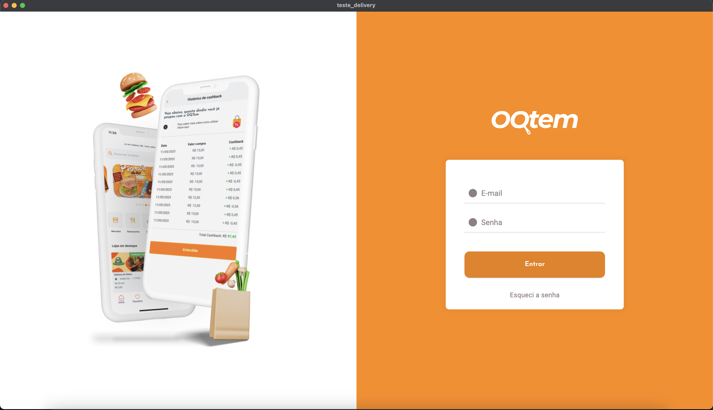
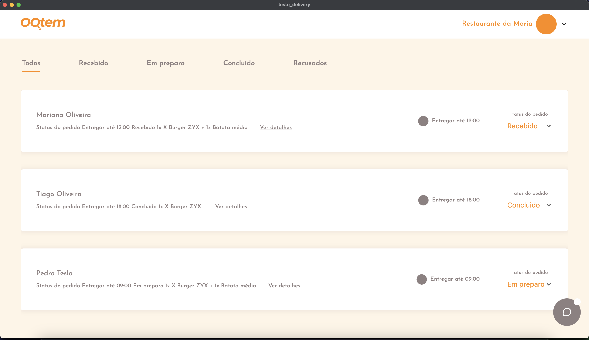
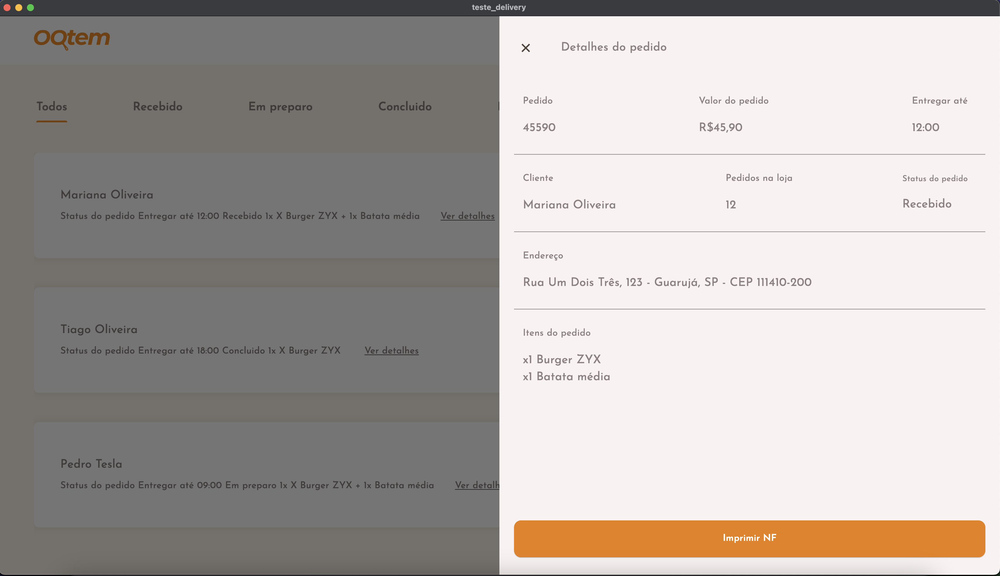
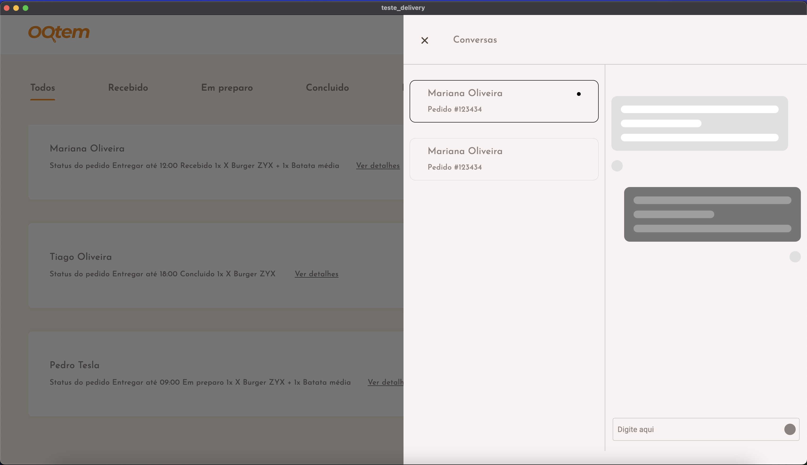
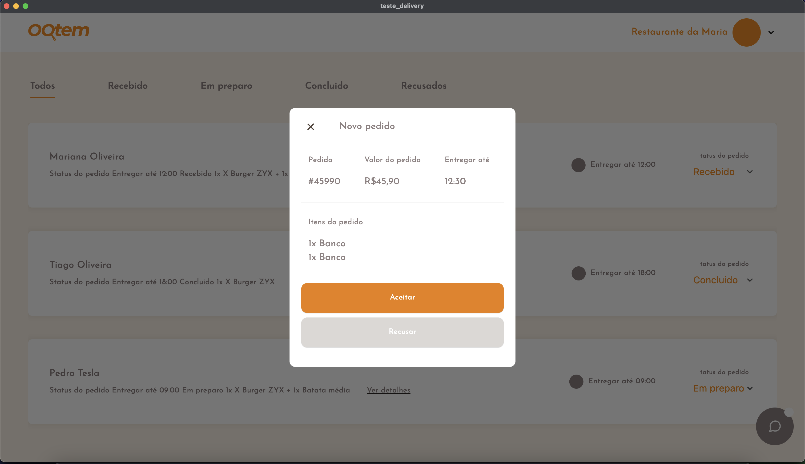

Comptrade

# _Teste_Delivery_

O TesteDelivery é um projeto Flutter elaborado com o propósito de demonstrar habilidades práticas na construção de um aplicativo, seguindo boas práticas e técnicas de desenvolvimento para web e desktop. 


Nesse documento contém a documentação simples da [Arquitetura do projeto](ARCHITECTURE.md).

Os benefícios das práticas adotadas incluem um software escalável e fácil de manter. A centralização de pacotes e bibliotecas em um único local, o núcleo do aplicativo (Core), simplifica a remoção ou substituição desses elementos. Cada camada possui responsabilidades distintas, seguindo os princípios de inversão de controle, responsabilidade única e baixo acoplamento. Essa arquitetura simplificada é adequada para o projeto atual, que não demanda a introdução de camadas adicionais.


## Plataformas

 


## Como usar 

**Passo 1:**

Baixe ou clone este repositório usando o link abaixo:

```
git clone project
```

**Passo 2:**

Vá para a raiz do projeto e execute o seguinte comando no console para obter as dependências necessárias: 

```
flutter pub get 
```

**Passo 3:**

Pronto ! pode executar o comando para iniciar o app:

**Obs: O projeto é para DESKTOP mas tem a possibilidade de ser executado na web.**

```
flutter run
```

**Passo 4:**

Login e senha para acessar o app:


```
Login: teste@com.br
```
```
Senha: 123123123
```

## Run web (Obrigatorio)

Precisa descomentar a linha para adicionar a função para habilitar a rotas do app no navegador _usePathUrlStrategy()_:

```dart
import 'package:flutter/material.dart';
import 'package:flutter_modular/flutter_modular.dart';
import 'package:teste_delivery/app/app_module.dart';
import 'package:teste_delivery/app/app_widget.dart';

void main() async {
  // usePathUrlStrategy(); //  descomentar essa linha

  runApp(
    ModularApp(
      module: AppModule(),
      child: const AppWidget(),
    ),
  );
}
```

### Estrutura de pastas
Aqui está a estrutura de pastas na estrutura do app.

```
flutter-app/
|- android
|- assets
|- build
|- web
|- macos
|- lib/
    |- app/
        |- core/
            |- constants
            |- exception
            |- navigation
            |- services
            |- themes
            |- types
            |- value_objects
            |- widgets
        |- modules 
        |- app_module.dart
        |- app_widget.dart
    |- main.dart
|- test
```
##  Layout do App

_
_
_
_
_


